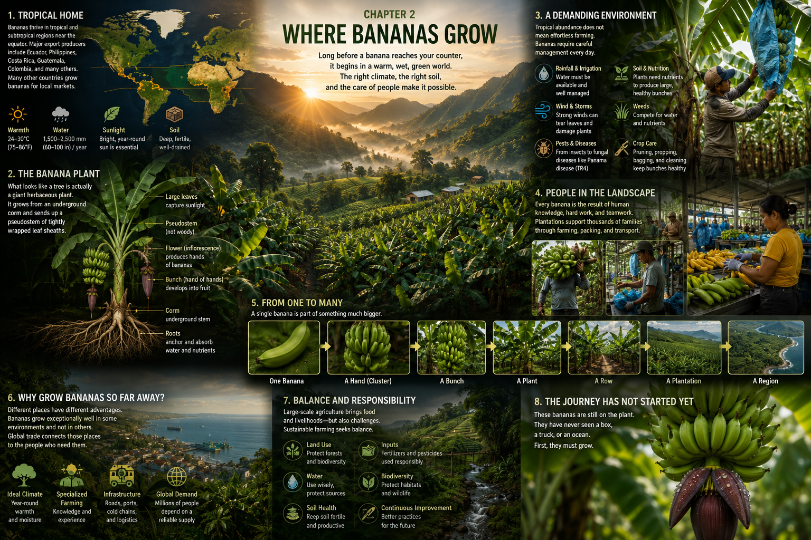

# 2. Where Bananas Grow

Dawn arrives first as a thinning of the dark.

Mist hangs low between rows of banana plants. Beyond them, hills rise through
cloud, their outlines still blue with night. Then the first sunlight reaches
the highest leaves. Each one is broad enough to gather a small weather system:
rainwater trembles in its channels, joins into beads, and drops to the
rain-dark soil below.

The air is already warm. Frogs and insects sound from the vegetation. A worker
moves along a narrow path, briefly visible between green walls, then disappears
again. On both sides, pale pseudostems lift overlapping leaves high above the
worker's head. Farther away, the rows merge into a single luminous field.

Nothing here resembles the kitchen counter. There are no stickers, boxes, cold
rooms, or price labels. There is only a cultivated tropical landscape waking
after rain—and, beneath one canopy of torn leaves, a bunch of hard green fruit.

The banana's global journey begins with a very local set of biological
requirements. Before refrigeration, container ships, trucks, warehouses, or
supermarkets can matter, the plant needs the right place to live.

## A Belt of Warmth

Trace the warm middle of a globe and much of the banana's geography comes into
view. Bananas are grown across tropical regions of Asia, Africa, the Americas,
the Caribbean, and the Pacific, with cultivation extending into warm,
frost-protected parts of the subtropics. The landscapes are not interchangeable.
A farm might stand on a humid coastal plain, in a river valley, on an island
slope, or below forested mountains. Its rainy months, dry months, soils, winds,
and altitude may differ greatly from those of a farm an ocean away.

What links these places is not a border but a plant's needs. Banana plants grow
best with sustained warmth, abundant sunlight, adequate water, fertile soil,
and good drainage. Their large leaves present an enormous surface to sun—and to
drying winds. Their tissues contain a great deal of water. Drought can check
growth unless rainfall or irrigation supplies what is missing, while saturated,
poorly drained ground can deprive roots of oxygen and favor disease. A soil must
hold useful moisture and nutrients without simply becoming a stagnant pool.

Cold draws a harder boundary. Bananas do not tolerate frost, and growth slows
as temperatures fall. In an equatorial climate, where warmth and water remain
available, plants can be at different stages throughout the year; there need
not be one brief harvest season like that of an orchard in a cold winter
climate. Subtropical production faces more seasonality. Cooler months, dry
periods, storms, elevation, and local cultivars all change the calendar. “The
tropics” is not one endless summer, and no single growing schedule describes
every banana farm.

This warm belt also reveals a distinction hidden by the produce aisle. The
places that grow the most bananas are not necessarily the places that ship the
most bananas abroad. India and China are among the very large producers, and
much of their fruit is consumed within their own domestic markets. Bananas and
plantains are also staple foods and local market crops across many parts of
Africa, Asia, Latin America, and the Caribbean. By contrast, the international
trade in the sweet dessert bananas familiar to many North American and European
shoppers is supplied heavily by export-oriented industries in Latin America
and the Caribbean, with Ecuador a leading exporter.

Production, then, is larger and more varied than export trade. Some bananas
cross an ocean in refrigerated cargo; many travel only to a nearby town, and
some are eaten close to the farm. A map of all banana plants is not the same as
a map of supermarket supply chains.

## Not a Tree

Walk into the rows and the plants rearrange one's sense of scale.

A mature banana plant can tower overhead. Its central column looks like a
smooth green trunk, sometimes streaked with wine-red or brown. But cut through
it and there are no growth rings, branches, or wood. A banana is a giant
herbaceous flowering plant. Its apparent trunk is a **pseudostem**—a false stem
made from the tightly nested, spiraling sheaths at the bases of its leaves.
Imagine many broad leaves rolled around one another so firmly that together
they can hold a crown in the air.

The plant's enduring center is lower down. At and below the soil surface sits a
compact underground stem commonly called a **corm**, or rhizome. Roots spread
from it into the surrounding soil, gathering water and mineral nutrients. New
shoots, often called suckers, can rise from buds on this underground structure.
The plantation therefore contains not only what is visible above the ground but
an architecture of roots, buds, and stored living tissue beneath each path.

Above, the leaves unfold like immense green paddles. Sun shines through the
youngest ones, illuminating parallel veins. Older leaves often split along
those veins, so their edges stream in ribbons after wind. This can look like
damage even where the plant continues growing, though severe wind can shred
leaves, topple plants, and scar fruit.

When the plant is ready to flower, its true stem grows upward through the hollow
heart of the pseudostem. The flowering structure emerges and bends toward the
ground. At its tip hang large, often purple-red bracts, layered like the hull of
a boat. As bracts lift and curl back, they reveal rows of flowers. The flowers
that develop into fruit sit in groups that will become the “hands” of a bunch;
each individual banana is a “finger.” In the common seedless commercial
cultivars, fruit can develop without pollination.

Stand close and the familiar object becomes strange again: tiny green bananas
curve beside spent flowers, above a glossy purple bud, all suspended from a
plant that looks like a tree but contains no wooden trunk.

## Abundance, Carefully Maintained

Rain on huge leaves and green growth in every direction can make a banana field
seem effortlessly fertile. It is not.

A plantation is an agricultural landscape, not untouched tropical nature. Its
rows, paths, drains, irrigation lines, selected plants, and packing routes have
been arranged and repeatedly maintained to produce a crop. Even on a small,
mixed farm where bananas grow beside other plants, people make choices about
planting material, spacing, water, soil fertility, and harvest.

Water shows the balancing act. In a dry period, sprinklers, drip lines, or other
irrigation systems may carry water through the field; practices depend on the
place and the farm. After intense rain, channels and well-drained soil must move
excess water away. Plant nutrients removed in fruit and leaves must be renewed
through farm-specific combinations of soil management, organic material, and
fertilizers. Weeds compete for light, water, and nutrients. Extra shoots may be
managed so the plant can support a sequence of productive stems rather than a
dense thicket.

Then there are living competitors. Insects, nematodes, bacteria, viruses, and
fungi can injure banana plants or fruit. Some fungal diseases spread through
leaves; others persist in soil and attack the plant's vascular system. Disease
pressure, susceptible cultivars, and the genetic similarity of large plantings
can make prevention and monitoring especially important. Growers respond in
different ways according to the threat, climate, resources, regulations, farm
scale, and production system. Field sanitation, drainage, clean planting
material, resistant varieties where available, biological or chemical
controls, and close observation may all have roles. There is no universal farm
recipe.

Weather can undo careful work in minutes. Heavy rain drums on the canopy. Wind
turns whole leaves pale-side-up, lashes them against one another, and leans
fruit-laden plants toward the earth. Supports or ties may help stabilize a
heavy plant in some systems, but a powerful tropical storm can overwhelm them.
Agriculture here depends on tropical abundance while remaining exposed to
tropical force.

## People Between the Leaves

The worker on the dawn path is not passing through a self-sustaining garden.
The path exists because people use it.

As the light strengthens, more figures move among the plants. One inspects
leaves for signs of stress or disease. Another clears vegetation or tends a
drain. Elsewhere, workers manage irrigation, remove unwanted shoots and old
leaves, support plants, or place protective covers around developing bunches.
They judge growth and fruit condition, carry tools and materials through humid
rows, and eventually cut heavy bunches and guide them toward the farm's packing
infrastructure. Equipment and job divisions vary: a smallholder household, a
cooperative, and a large export plantation do not organize the same landscape
in the same way.

Nor does the word *worker* describe one universal experience. Pay, contracts,
housing, safety protections, union representation, access to training and
health care, exposure to hazards, and enforcement of regulations vary widely
between countries and producers. So do farm ownership and the economic power of
growers within the supply chain. To acknowledge those differences is not to
turn the people in the field into symbols. It is to see the physical truth: a
banana plantation functions through skilled, repeated human work, performed in
heat, moisture, mud, and sometimes difficult conditions.

## One Crop in a Living Landscape

Agriculture changes a place in order to feed people. Producing a great quantity
of one crop can make that change particularly visible.

Land devoted to uniform plantings may support less biodiversity than the
ecosystem it replaced. Irrigation can put pressure on water supplies; poor
drainage and erosion can damage soil and water. Fertilizers can nourish a crop
but cause harm when nutrients move beyond it. Pesticides can control serious
pests and diseases while also creating risks for workers, nearby communities,
water, and non-target life if they are hazardous or poorly managed. Large areas
of genetically similar plants can intensify disease pressure, which may in turn
increase the demand for control.

These are not identical outcomes on every farm. Landscape history, crop mix,
methods, weather, regulation, worker protection, and the care with which inputs
are chosen and applied all matter. Banana agriculture can include industrial
monocultures, smaller farms, and more diverse growing systems. The honest view
is neither a postcard of limitless green nor a single verdict. It is a managed
system with benefits, costs, risks, and choices—questions to keep in sight as
we follow the fruit.

## From Finger to Globe

Now choose one newly formed banana beneath a lifted bract.

It is no longer than a finger. Pull back and it joins a hand of neighboring
fruit. Pull back again: several hands spiral around a thick stalk to form a
bunch. The bunch hangs from one plant; the plant stands in one row; the row
runs beside dozens of others until their leaves become a textured green plain.
The plantation joins roads, waterways, villages, packing stations, and other
farms across a banana-growing region.

Rise farther. Warm production regions appear around the globe, scattered
through the tropics and subtropics. From some of them, imagined lines reach
toward distant cities in cooler latitudes. A biological event measured in
centimeters—the swelling of one flower's ovary into one seedless fruit—connects
to a commercial system measured in oceans.

Why grow breakfast so far from the people who will eat it?

Because places differ. Climate and soils matter first, but so do generations of
agricultural knowledge, available labor, land, roads, packing facilities,
ports, investment, and trading relationships. Bananas flourish in environments
where field production can continue for much of the year; in a frosty climate,
an outdoor commercial crop may be impractical or impossible. Transportation
allows a region suited to growing bananas to serve consumers in a region that
is not.

That geographic specialization helps explain how the system can exist, though
not who gains from it, what it costs, or how it came to take its present shape.
Those questions will travel with us.

For now, lower the camera through the mist and leaves, all the way back to the
single bunch.

The morning water has dried from its green skins. The fruit is larger than it
was, but it is still attached to the plant. It has not entered a box. It has
never seen a truck. It has never approached an ocean.

Its global journey has not started.

First, it has to grow.

## Sources and Further Reading

- [Food and Agriculture Organization of the United Nations: Banana facts and
  figures](https://www.fao.org/markets-and-trade/commodities/bananas/en/)
- [Food and Agriculture Organization of the United Nations: Banana Market
  Review 2023](https://openknowledge.fao.org/handle/20.500.14283/cc9120en)
- [ProMusa: Banana botany](https://www.promusa.org/Banana+botany)
- [Royal Botanic Gardens, Kew: *Musa acuminata*](https://powo.science.kew.org/taxon/urn:lsid:ipni.org:names:797381-1/general-information)
- [University of Florida IFAS Extension: Banana growing in the Florida home
  landscape](https://edis.ifas.ufl.edu/publication/MG040)
- [CABI: *Musa* species (banana and plantain)](https://www.cabi.org/isc/datasheet/35124)

---

[← The Banana on the Counter](01-the-banana-on-the-counter.md) · [Contents](../CONTENTS.md) · [Growing a Banana →](03-growing-a-banana.md)
