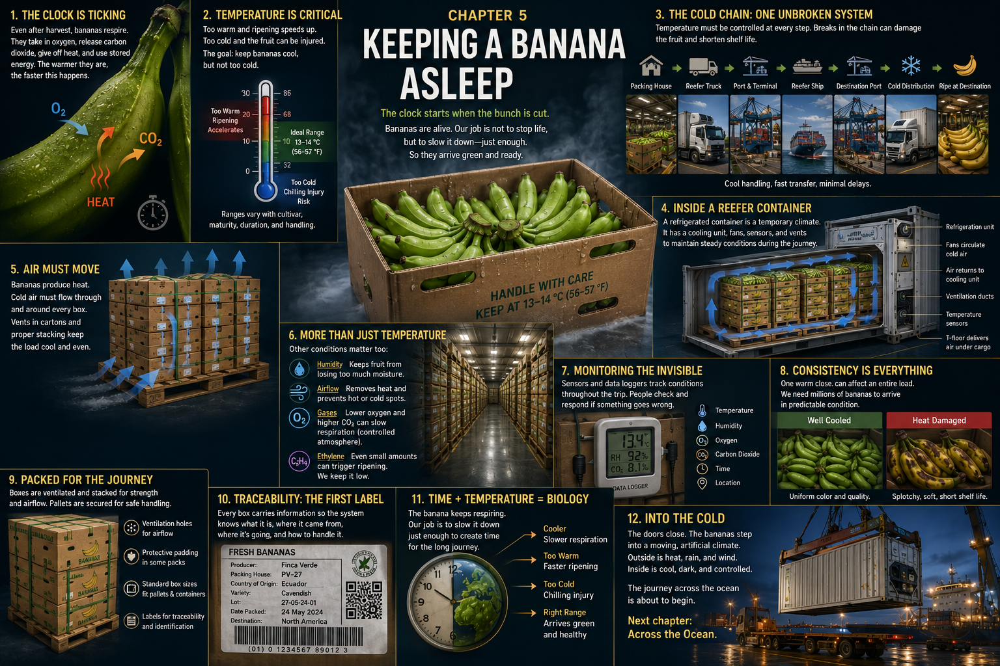

# 5. Keeping a Banana Asleep

A forklift carries the first pallet out of the packing house.

Behind it, the wash water flashes in the tropical light. Ahead, the open doors
of a refrigerated truck or container make a dark rectangle in the heat. The
boxes look quiet as they cross that threshold. Nothing spills. Nothing changes
color. There is no visible countdown printed on the cardboard.

But inside every box, the clock is already ticking.

Each green banana is still made of living cells. Enzymes are at work. Water and
gases move through tissues. Starches, sugars, and acids belong to chemistry that
did not end when the stalk was cut. The fruit does not know that it has entered
a supply chain. It is simply continuing to live.

**The logistics system wants time.**

**The banana's biology wants to move forward.**

The cold chain exists to manage that disagreement.

## A Breath After Harvest

A harvested banana no longer receives new energy from the plant, but it can use
material already stored inside it. In **respiration**, its cells use oxygen as
they release energy from organic molecules. Carbon dioxide, water, and heat are
produced along the way.

This is not breathing with lungs. Imagine, instead, exchanges taking place
across the fruit's surface and chemical reactions continuing in millions of
cells. In a close view, the green peel remains perfectly still; in an
illustrator's cutaway, faint currents of oxygen enter while carbon dioxide,
water vapor, and heat leave. The invisible activity is real even when the fruit
appears motionless.

Respiration is part of a larger field of metabolic activity. In general, when
that activity runs faster, stored reserves are used faster and ripening or
deterioration advances faster. Put thousands of respiring bananas together and
even their small releases of heat and moisture become conditions the cargo
system must handle.

The goal after harvest is not to stop the fruit's life. That would destroy the
very tissues people hope will later become soft, aromatic, and sweet. The goal
is more delicate:

**slow the biology without injuring the banana.**

## Between Heat and Harm

Temperature is one of the strongest levers available. Cooling generally slows
respiration and many of the biochemical reactions associated with ripening and
aging. A cooler green banana spends its stored energy more slowly than the same
banana held under warmer conditions.

Yet the thermometer has danger at both ends.

Bananas evolved and developed as tropical fruit. They cannot simply be stored
close to freezing as though colder must always be better. Excessive cold can
cause **chilling injury**: physiological damage at temperatures above the
fruit's actual freezing point. Depending on severity and exposure, the peel may
become dull, grayish, or dark; tissues may be damaged; and the fruit may ripen
poorly or unevenly after it returns to warmth.

For mature-green bananas, postharvest guidance commonly places transport or
storage conditions around **13–14°C (55–57°F)**, with high relative humidity.
That is a useful picture of the narrow operating zone, not a universal setting
for every load. Cultivar, maturity, growing conditions, exposure time, air
movement, packaging, carrier practice, and destination specification all
matter. Chilling injury, especially, is a relationship between temperature and
time—not a trapdoor at one identical number for every banana.

So picture a thermometer suspended between two scenes. At the warm end, green
fruit is spending its travel time too quickly. At the cold end, peels darken and
the later ripening process falters. The useful route runs between them.

Refrigeration does not freeze time. It makes the clock run more slowly.

## Cold Is a Chain

Now pull back from the thermometer. The cold space is not one room but a route:

**packing house → refrigerated staging or truck → refrigerated container →
port → ship → destination port → refrigerated transport → distribution
infrastructure**

This is the **cold chain**. The important word is *chain*.

A well-controlled ocean crossing cannot erase hours of excessive heat during
loading. A refrigerated container cannot repair chilling injury caused by an
incorrect setting. Fruit can drift away from its intended condition while it
waits on hot pavement, while doors stand open, during a delayed transfer, or
after a power interruption. A faulty sensor, malfunctioning refrigeration
unit, blocked air path, or poorly chosen setting can make a local problem inside
an otherwise impressive global system.

Every handoff is therefore physical and time-sensitive. Pallets leave shelter.
A driver waits for clearance. A terminal plug must supply electricity. A cable
must be connected aboard ship. Mechanics, drivers, equipment operators,
terminal workers, ship crews, and inspectors keep conditions continuous across
places owned and operated by different parts of the network.

Cold is not something applied once. It must accompany the fruit.

## A Climate Made of Steel

At the port, one container stands apart in sound as well as appearance. A
refrigeration unit occupies one end. Fans hum behind a grille. Power cables run
to ranks of similar containers, each plugged into the terminal's electrical
system. A light glows against corrugated steel.

This is a refrigerated container—a **reefer**—and it is more than a cold metal
box. Its machinery, fans, controls, vents where used, and sensors are designed
to maintain specified cargo conditions as the box moves through ordinary
container infrastructure. At a terminal it needs an external electrical
supply; aboard a container ship, reefer sockets provide power while systems and
crew watch for alarms and faults.

The reefer does not create winter indiscriminately, nor is it best imagined as
a machine that instantly pulls all the heat from warm cargo. Fruit condition at
loading and preparation earlier in the chain still matter. Once operating, the
container becomes a temporary artificial climate built around a tropical crop.

Outside: sun, diesel exhaust, salt air, steel, and warm rain.

Inside: green fruit, measured temperature, moving air, and darkness.

## Air Must Find Every Box

Open the steel walls in a cutaway and the hidden climate begins to move.

In a common reefer airflow arrangement, conditioned air travels beneath the
load along the container's grooved floor. It rises through and around the cargo,
passes ventilation openings in cartons, gathers heat, and returns toward the
refrigeration unit. Fans keep the circuit moving.

That route explains details established back at the packing table. The slots in
a banana carton are not decoration. The pallet arrangement is not merely a way
to fit the greatest number of boxes inside. Ventilated cartons, aligned openings,
appropriate stacking, clearance, and an unobstructed floor path help conditioned
air reach through the load rather than taking an easy shortcut around it.

The bananas themselves keep producing heat through respiration. If air cannot
carry that heat away, the middle of a tightly packed region may behave
differently from fruit closer to a clear air path. A crushed carton, displaced
liner, poorly placed pallet, or cargo extending where air needs to return can
change the local climate.

In the cutaway, make the air visible: a pale blue current entering below the
stacks, dividing into hundreds of narrow upward paths through green-and-brown
layers, then returning overhead. The image is almost architectural. A cold
chain is built not only from machines but from empty spaces deliberately left
open.

## More Than a Number on a Thermostat

Temperature leads the story, but it does not act alone.

High relative humidity can limit water loss and shriveling, while condensation
and conditions favorable to decay must still be managed. Airflow distributes
heat and moisture. Ventilation can exchange gases with outside air. Oxygen is
consumed in respiration; carbon dioxide is released. And nearby sources of
**ethylene**, a natural plant hormone, can influence the fruit's timetable.

Bananas are **climacteric fruit**. As ripening begins, they show a characteristic
rise in respiration and ethylene production, and exposure to ethylene can
initiate and coordinate that change in mature fruit. Commercial ripening rooms
will later use this responsiveness deliberately. That is Chapter 8. During the
green voyage, the aim is the opposite: avoid conditions or accidental ethylene
exposure that could start or accelerate the transformation too soon.

Some transport systems also manage the mixture of gases around the cargo.
Controlled- or modified-atmosphere approaches can reduce oxygen and adjust
carbon dioxide within carefully managed limits, further slowing respiration
and ripening. The exact technology and atmosphere are not the same for every
shipment, and temperature management remains essential. Too little oxygen or
too much carbon dioxide can cause injury or unwanted metabolism rather than
preservation.

The artificial climate is therefore a balance, not a single cold setting:

**temperature + humidity + airflow + atmosphere + time**

## A Race Against Unevenness

Imagine one container at night, carrying box after box after box. The setting
shown on its controller is one number. The fruit inside is not one object.

A box beside a blocked opening may retain more heat. Fruit near a door opened
in tropical air may have a different history from fruit deep in the stack. One
pallet may have entered warmer. One crushed corner may interrupt airflow. Even
bananas harvested at sensible maturity are not biologically identical.

It is not enough for the *average* banana to remain cool. Importers, ripening
operators, retailers, and customers need millions of fruits to arrive in
reasonably predictable condition. If one region of a load advances ahead of
another, the difference may become much more obvious when ripening begins.

Here is a lesson much larger than a banana:

**A large system can fail because of local conditions.**

Consistency depends on details small enough to disappear inside a sealed box.

## Evidence From the Dark

Once the doors close, people cannot continuously see the peels. They use
physical evidence instead.

Container control systems measure conditions at designated points. Portable
temperature recorders or probes may travel among cartons. Shipment records
preserve settings, times, alarms, and handoffs. At arrival, inspectors examine
fruit and compare what they find with the journey that was supposed to happen.
Different carriers and supply chains use different instruments, sampling
locations, and records; a sensor reading is evidence from one place, not magic
knowledge of every banana.

The essential question is not simply, *Do we have data?*

It is:

**Did the bananas actually experience the conditions we intended?**

A small recorder nestled between cartons becomes a witness. Its history can
help reveal a warm delay, an interrupted power supply, an incorrect setting, or
a stable passage through a storm. Monitoring makes part of an invisible
physical journey visible after the fact.

## Not Really Asleep

To call these bananas *asleep* is a metaphor.

They have not stopped breathing. Their cells have not shut down. Fans cannot
pause chemistry, and refrigeration cannot return an hour already lost. The
fruit remains alive, using stored reserves and edging forward even in the dark.

But the metaphor captures what the system is trying to achieve. By holding the
bananas in a carefully slowed biological state, the cold chain delays the
dramatic change from hard, mature-green fruit to soft, sweet yellow fruit. It
borrows enough time for distance.

Later, in a ripening facility, the fruit will need to “wake.” Temperature,
airflow, humidity, and ethylene will be managed for a different purpose. For
now, the transformation waits.

## Into the Cold

The last pallet enters the reefer.

Outside, a warm tropical port works beneath towers of light. Trucks turn between
stacks. Workers in reflective clothing move past cables and chassis. Hundreds
of refrigerated containers stand in rows, plugged into electrical power, their
fans making a low mechanical chorus beside the sea.

Inside our container, green clusters rest in ventilated cartons. Cool air moves
beneath the stacks and rises through the openings. A sensor keeps its quiet
record. Heat leaves the fruit a little at a time.

The doors swing inward.

For perhaps the first time in this story, the banana disappears completely from
view: sealed inside a box, inside a container, inside a transportation system.
It is not frozen. It is not paused. It is alive in a climate designed to make
life proceed slowly.

A crane approaches. Locks meet the container's upper corners. Steel cables
tighten, and the box rises from the ground. Below it are trucks, workers, white
lights, and rows of machinery. Beyond the quay, a ship waits under the night
sky. Farther still is black water.

The cold chain has bought time.

Now distance will spend it.

Next: **Chapter 6 — Across the Ocean**

## Sources and Further Reading

- [UC Davis Postharvest Research and Extension Center: Banana produce fact
  sheet](https://postharvest.ucdavis.edu/produce-facts-sheets/banana)
- [Food and Agriculture Organization of the United Nations: Manual for the
  preparation and sale of fruits and vegetables](https://www.fao.org/4/y4893e/y4893e00.htm)
- [Food and Agriculture Organization of the United Nations: Good practice in
  the design, management and operation of a fresh produce packing-house](https://www.fao.org/4/i2678e/i2678e00.pdf)
- [Maersk: Refrigerated container guide](https://www.maersk.com/support/faqs/2023/04/28/what-is-a-reefer-container)
- [CMA CGM: Controlled atmosphere for refrigerated cargo](https://www.cma-cgm.com/products-services/reefer/controlled-atmosphere)
- [Kader, *Postharvest Technology of Horticultural Crops*, University of
  California Agriculture and Natural Resources](https://anrcatalog.ucanr.edu/Details.aspx?itemNo=3311)

---

[← Harvest Day](04-harvest-day.md) · [Contents](../CONTENTS.md) · [Across the Ocean →](06-across-the-ocean.md)
