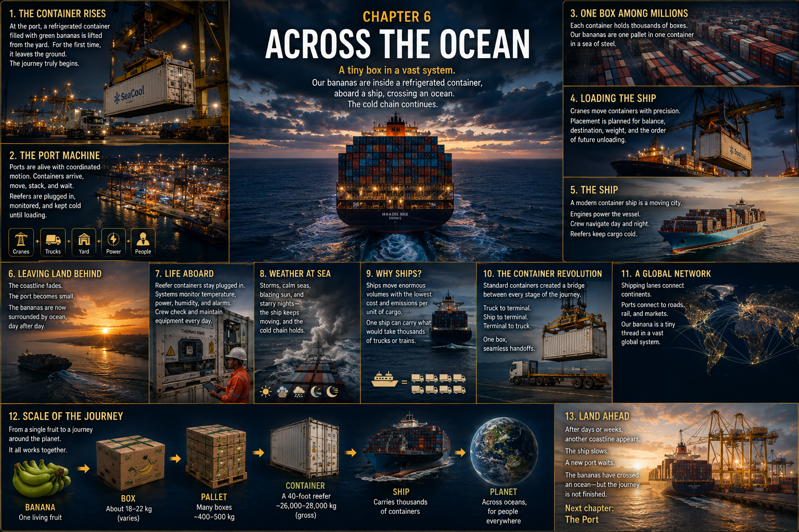

# 6. Across the Ocean

The container rises.

For a moment it hangs beneath the gantry crane, a long white rectangle against
the tropical night. Floodlights burn over the quay. Below, terminal trucks turn
between painted lanes, and workers in reflective clothing have become bright,
moving flecks. Stacks of containers rise nearby like windowless buildings.
Ahead, an enormous ship waits with its deck open to the sky.

We know what the lifted container holds. We saw the green clusters fitted into
cartons, the cartons stacked onto pallets, and the pallets sealed behind steel
doors. But from the dock, the bananas have vanished.

That disappearance matters. For much of the journey ahead, our fruit will exist
as **a banana inside a box inside a container inside a ship inside a global
transportation network**.

One small piece of living tissue has entered a machine almost as large as the
planet.

## The Port Breathes

Seen from above, the terminal seems to inhale and exhale steel boxes.

Trucks arrive from inland roads and leave with different loads. Yard equipment
carries containers into temporary rows. Stacks grow, pause, and shrink. At the
water's edge, ship-to-shore gantry cranes stride across the quay on legs tall
enough for vehicles to pass beneath them. Their booms reach over vessels; their
lifting frames lock onto the strong upper corners of containers.

This is a container terminal: the physical hinge between land transport and
sea transport. Its container yard is not simply a parking lot. It is a carefully
ordered waiting place. A box buried under the wrong stack may require other
boxes to be moved before it can leave. A box delivered too late may miss its
ship. Thousands of movements—by road trucks, terminal tractors, cranes, and
other lifting machines—must become one coordinated sequence.

Refrigerated containers add another rhythm. In designated rows, power cables
connect reefers to the terminal electrical supply. Their refrigeration units
hum while the containers wait, and workers monitor them and respond when a unit
or connection reports trouble. Ordinary boxes can stand silently. A reefer is a
small climate that must keep running.

The port looks alive because it is full of motion. Yet none of it is random.

## One Box in the Mountain

Return, for a moment, through the closed doors.

One banana rests in one cluster, arranged in one ventilated carton. That carton
is one among many on a pallet. The pallet is one among several inside the
reefer. The reefer now passes walls made from thousands of nearly identical
steel boxes.

**How can the system possibly know where everything belongs?**

A container carries a unique identification marking on its exterior. Shipping
instructions and transport documents connect that physical identity to such
information as its cargo, shipper, destination, weight, and journey. A vessel's
cargo manifest accounts for what it carries; terminal and carrier records tell
people which identified box is expected, where it should go, and where it was
handled. Marks on the banana cartons preserve a finer thread back toward the
packing operation and lot.

The records are invisible from our wide view, but their consequences are made
of steel. This particular giant box must be presented to the correct terminal,
loaded onto the correct vessel, discharged at the correct destination, and
released into the correct inland journey. Information gives the machinery a
place to send it.

## Into the Wall

High in the crane, machinery draws the trolley—and our suspended reefer—away
from the land. The container travels horizontally above the dock, crosses the
side of the ship, stops, and begins to descend.

Loading a vessel is not a game of filling every empty rectangle. Planners must
consider where containers will leave the service, so cargo needed at an earlier
port is not needlessly trapped beneath cargo for a later one. They consider
container type and weight, the ship's strength and stability, and the sequence
in which cranes can work. Reefers need positions with suitable electrical
connections. The verified weight of packed containers is important to safe
stowage and ship operation.

Guides and locking equipment bring the reefer into its planned place. Metal
meets metal. The crane releases it.

For several seconds, a fortune of green fruit dangled alone beneath an enormous
machine. Now even the container is difficult to find. It has disappeared into a
wall of red, blue, gray, and white boxes.

## A Moving Piece of Infrastructure

The ship beneath that wall is not just a large truck placed on water.

Its hull contains tanks, passageways, machinery, and an engine room where fuel
is converted into motion. A propeller pushes an immense mass through the sea.
High above the deck, the bridge holds navigation and communications equipment
and gives the crew a view forward. Generating and distribution systems supply
the vessel's own needs, including electrical power for connected refrigerated
containers. Crew members navigate, maintain machinery, keep watch, inspect the
ship and cargo systems, and prepare for arrival and departure.

The deck is less like a floor than a moving grid of cargo. Containers fill
holds and rise in rows above them, secured against the forces of a voyage.
Together the vessel, port equipment, crews, schedules, channels, pilots,
tugboats, and navigation systems form infrastructure that moves.

Bananas once crossed oceans extensively in specialized refrigerated ships, and
such vessels remain part of refrigerated trades. Today, many travel in reefers
through container networks. The change is visually profound: instead of the
ship itself being one refrigerated hold devoted largely to fruit, each reefer
carries its own managed compartment within a vessel carrying many kinds of
cargo.

## Land Falls Away

Lines are released. The ship eases from the berth, sometimes with tugboats and
local pilots helping it move safely through the harbor.

The cranes that towered over the dock shrink behind the stern. Container stacks
become colored blocks. City lights gather into one thin band, then scatter. At
sunset the tropical coastline is a dark green shape beneath an orange sky. By
night, it is gone.

Our banana has left the continent where it grew.

Outside the container:

**sun → wind → rain → waves → storms → salt air**

Inside the container:

**controlled temperature → moving air → darkness → green bananas**

This is the strangest separation in the journey so far. The ocean may flash
white under hard sunlight or turn black beneath thunderclouds. The ship may
pitch through heavy swells. Salt spray may cross the deck. None of these places
touch the peel. The fruit experiences global geography as power, vibration,
time, and the steady circulation of cool air.

## Keeping a Climate Alive at Sea

Once aboard, the reefer is connected to a vessel power socket. Its refrigeration
system continues the work begun on land: fans circulate conditioned air through
the grooved floor and ventilated cartons, while machinery removes heat to hold
the specified environment.

But plugging in a cable is not the end of the task. Shipboard systems and crew
monitor reefer operating conditions. Alarms can indicate a power interruption,
temperature problem, or equipment fault. Crew members make rounds, inspect
units and connections, and respond within the limits of the equipment and
conditions aboard. Maintenance and repair capability matter because the farm
and destination are now beyond the horizon.

The cold chain from Chapter 5 has not become less physical at sea. It depends on
generators, wiring, sockets, compressors, fans, sensors, spare parts, procedures,
and people. Thousands of miles from a grocery aisle, someone still has to notice
when a small climate is in danger of changing.

## Water, Weather, Time

There is no single ocean journey for a banana.

Fruit shipped from different producing countries travels toward different
consumer markets. A voyage may be direct or include other port calls. Its
duration depends on origin and destination, the carrier's service and schedule,
routing, port operations, weather, and disruptions along the way. A banana can
therefore spend a meaningful part of its postharvest life over water, but no one
distance or number of days describes every fruit.

Instead, watch the ship through changing light.

At noon it cuts a white wake through brilliant blue. At sunset, every container
edge glows copper. Heavy rain erases the horizon. Rough water sends spray over
the bow. Later the deck lies quiet under moonlight and stars, a dark city of
corrugated steel with only navigation lights and working machinery to reveal
its motion. Morning fog closes around the hull.

Weather can alter speed, routing, work aboard, and arrival schedules. The ship
cannot make the ocean constant. The reefer's purpose is to make the environment
immediately around the fruit far more constant than the world outside.

## Why a Ship?

Why build such an elaborate path merely to move bananas?

Because the ship is not moving one box.

It carries enormous quantities of cargo in one voyage. Shared across all those
goods, the ship, fuel, crew, and journey can move each unit with an efficiency
that separate small journeys could not match. This is **economy of scale**: a
very large operation can spread some of its effort and cost across a very large
load.

Standardized containers add another kind of efficiency. Before widespread
containerization, much general cargo had to be handled piece by piece or in
smaller units as it moved between ship, dock, warehouse, and land transport.
Every transfer took labor and time and created another opportunity for delay,
loss, or damage.

The container created a common physical interface. The same steel box can be:

- carried by truck;
- lifted by a terminal crane;
- stacked temporarily in a yard;
- secured aboard a ship;
- unloaded by another crane; and
- placed on another truck or compatible land transport.

The cartons inside do not have to be individually carried across the quay at
each handoff. **Truck → terminal → ship → terminal → truck** becomes a chain of
machines designed around the same corners, dimensions, and lifting points.

This is systems engineering made physical. It is also part of the answer to the
question we asked in Chapter 1: how can imported tropical fruit remain an
ordinary grocery purchase? The complete answer includes much more—and who pays
which costs will wait for Chapter 10—but moving large quantities through shared,
standardized infrastructure makes distance less expensive than its scale might
suggest.

## The Cost of Moving an Ocean

Efficiency does not make the voyage impact-free.

Ships consume fuel. Their operation produces greenhouse gases and air
pollution, and ports, vessels, containers, refrigeration, and inland connections
all require energy and materials. International shipping's total environmental
impact matters precisely because the system is so large.

There is also a second scale to consider: impact per unit of cargo moved. A huge
ship can have a substantial total footprint while dividing parts of that
footprint across a vast load. Comparing transport choices therefore requires
more than calling one mode simply “clean” or “dirty.” Distance, vessel and fuel,
cargo quantity, refrigeration, speed, loading, infrastructure, and realistic
alternatives all affect the result.

The honest image contains both truths: smoke leaves a funnel above a ship that
is moving a mountain of goods at once.

## A Thread Around the Planet

Now rise until the ship itself begins to vanish.

First it becomes a white wake across an enormous blue surface. Higher still, it
is a point on a chart. Other points appear. Routes gather between ports. Around
the coastlines, terminals connect to roads and railways that branch inland.

Somewhere in this moving web are food, clothing, machinery, electronics, raw
materials, and manufactured goods. Each has its own origin and destination;
each occupies a box that looks nearly identical from the sky. Ports join
continents, and sea lanes become threads around a globe.

Our change in scale is now complete:

**banana → box → pallet → container → ship → ocean → Earth**

The banana has revealed more than a food system. Hidden in its journey is the
physical structure of globalization: standardized objects, specialized
machines, energy, information, infrastructure, and human work allowing distant
places to exchange material things.

And inside one almost invisible point, our particular fruit is still green.

## Land

Early one morning, the horizon changes.

At first there is only a faint gray line beneath the sunrise. Then the line
separates into land and buildings. Cranes rise above it, unmistakable even from
far offshore. As the ship approaches, breakwaters, channels, warehouses, and
the hard geometry of another container port come into view. A pilot and
tugboats may assist where the harbor and operation require them. On shore,
gantry cranes wait with their booms raised.

The bananas are still green. Still boxed. Still inside the refrigerated
container. They have crossed an ocean without seeing sunlight.

One fruit disappeared into a steel box in the tropics. It crossed open water
inside a floating city of cargo and has arrived thousands of miles away still
alive, still breathing, still waiting to ripen.

But land is not a grocery store.

Before the banana can continue, the great machine must reverse itself:

**ship → crane → terminal → inspection → inland transportation**

The ship slows. The first lines go ashore. Above the quay, a crane begins to
move.

Next: **Chapter 7 — The Port**

## Sources and Further Reading

- [International Maritime Organization: Containers and cargoes](https://www.imo.org/en/ourwork/safety/pages/cargoesandcontainers.aspx)
- [International Maritime Organization: Improving the energy efficiency of
  ships](https://www.imo.org/en/ourwork/environment/pages/improving%20the%20energy%20efficiency%20of%20ships.aspx)
- [United Nations Conference on Trade and Development: Review of Maritime
  Transport 2024](https://unctad.org/publication/review-maritime-transport-2024)
- [International Labour Organization: Safety and health in ports](https://www.ilo.org/resource/other/safety-and-health-ports-revised-2016)
- [Bureau International des Containers: Container identification](https://www.bic-code.org/identification-number/)
- [Maersk: Refrigerated container guide](https://www.maersk.com/support/faqs/2023/04/28/what-is-a-reefer-container)
- [Maersk: Remote Container Management for refrigerated cargo](https://www.maersk.com/digital-services/captain-peter/remote-container-management)
- [Food and Agriculture Organization of the United Nations: Banana facts and
  figures](https://www.fao.org/markets-and-trade/commodities/bananas/en/)

---

[← Keeping a Banana Asleep](05-keeping-a-banana-asleep.md) · [Contents](../CONTENTS.md) · [The Port →](07-the-port.md)
