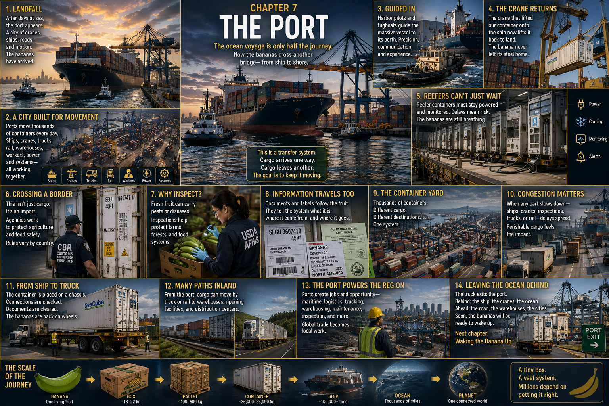

# 7. The Port

Sunrise finds the ship moving toward a wall of land.

After days of ocean, the horizon has begun to acquire details. A gray line
becomes a coastline. Buildings separate from one another. Bridges lift above
the water. Warehouses spread low beside roads, and gantry cranes stand against
the brightening sky like immense steel animals.

The clean geometry of the open sea—water, sky, horizon—is replaced by an
industrial landscape layered in motion. A tugboat throws white water from its
stern. Trucks pass between container stacks. Rail lines shine briefly in the
morning light. Ships wait at berths while cranes reach across their decks.

Our banana has crossed an ocean.

But it still has hundreds of physical movements ahead of it.

## A City Built for Movement

From the water, the port looks less like one place than a city assembled from
specialized parts.

There are quays strong enough to support towering ship-to-shore cranes; paved
yards where containers form windowless blocks; terminal roads striped with
lanes for machines and trucks. There are warehouses, rail tracks at some
terminals, maintenance areas, gates, security fences, inspection spaces, and
rows of electrical connections for refrigerated containers. Tugboats cross the
harbor below ships. Workers in hard hats and reflective clothing walk among
tires taller than they are.

Every part points toward the same purpose. A port is a **transfer system**.
Cargo arrives in one form of transportation and must leave in another. Ship,
crane, yard machine, truck, and sometimes rail all meet here because each can
handle the same standardized steel box.

The port is not successful when the bananas stay. Its work is to move them
through.

## Alongside

First, the ship must reach exactly the right strip of concrete.

A harbor pilot with detailed local knowledge may board to help guide the vessel
through the port's channels and toward its assigned berth. Tugboats may push,
pull, or stand ready as the ship turns at low speed. On the bridge, pilot and
ship's crew coordinate; on shore, line handlers wait.

The vessel eases alongside. Heavy mooring lines arc down and are secured. The
ship that looked small against the ocean now forms a steel cliff beside the
quay. Even arrival at the dock has required people, machines, water, weather,
space, and timing to agree.

Above it, the cranes begin to move.

## The Crane Returns

At the first port, a gantry crane lifted our refrigerated container **onto**
the ship. Now another performs the motion in reverse.

The crane's trolley travels out over the vessel. Its spreader descends and
locks onto the container's upper corners. Securing devices that held the box in
place through the voyage have been released. Cables tighten.

The reefer rises out of the colored wall.

For a moment, it hangs high above the deck: a white steel rectangle suspended
between ship and shore. Beneath its corrugated roof, inside dark cartons, the
green fruit feels only a change in vibration. The bananas do not see the water,
the sunrise, or the workers guiding the operation.

The trolley rolls landward. The container crosses the ship's side and descends
toward a terminal vehicle waiting below.

> **After crossing an ocean, the banana touches land without ever leaving its
> box.**

## A Climate That Cannot Wait

A dry steel container can wait without breathing. Our cargo cannot.

The reefer's refrigeration machinery needs energy to maintain the planned
conditions. During transfers there may be limited periods when it is not
connected to an external supply; terminal procedures are designed to move it
to a designated reefer area and restore power. There, rows of refrigerated
containers stand with cables attached, fans turning and machinery humming.
Workers check connections and operating conditions and respond to alarms or
faults.

The scene is industrial, but the deadline is biological. Inside each carton,
living fruit continues to respire. Refrigeration can slow change; it cannot
abolish it.

The banana's biology does not care about congestion, paperwork, inspections,
equipment availability, or truck schedules. A delay measured on a terminal
clock is also time passing through the fruit. Every hour uses a little more of
the window bought by cooling.

## Crossing a Border

The banana has not only crossed an ocean. It has entered another country.

That change is invisible from the crane, yet it brings another sequence of
requirements. Imported food may be subject to customs procedures,
documentation, agricultural or phytosanitary rules, food-safety requirements,
and other import controls. Some decisions are made by reviewing records. Some
shipments may be selected for examination or sampling according to applicable
rules and risk. **Not every banana container receives the same physical
inspection.**

In the United States, the responsibilities are divided rather than handed to
one all-purpose inspector. U.S. Customs and Border Protection manages entry at
the border and its agriculture specialists inspect arriving cargo and enforce
plant-protection requirements on behalf of the U.S. Department of Agriculture.
USDA's Animal and Plant Health Inspection Service establishes plant-import
requirements intended to prevent the introduction of plant pests and diseases.
The Food and Drug Administration oversees the safety of most imported foods,
requires prior notice for food offered for import, and uses information and
risk-based tools to decide which shipments warrant closer review.

The exact path depends on the commodity, origin, condition, paperwork, and
regulatory circumstances. Clearance is not one stamp from one person. It is a
set of distinct questions that must be answered before the cargo can proceed.

## More Than Bananas

Why examine agricultural cargo at all?

A shipment can carry more than its intended product. Fruit and other plant
material—and soil, packaging, or the container around them—can potentially
transport insects, pathogens, weeds, or other unwanted organisms. Border
agriculture controls reduce the chance that a journey designed to move food
also moves a pest or disease into farms and ecosystems where it does not belong.

This does not make a banana box sinister. It makes it biological.

The shipment is simultaneously:

**food + cargo + biological material + an international import.**

Each identity creates a different reason to know what it is, where it came
from, and whether it meets the conditions for entry.

## Information in Ink and Steel

The label we followed from the packing house has crossed the ocean too.

Open the composition around the sealed container and information appears
everywhere: a unique number painted on corrugated steel; a seal fixed through
the door hasp; shipping marks on cartons; labels naming the commodity and
packing origin; papers accompanying the transaction; inspection or release
marks where the process calls for them.

Depending on the shipment and rules, documents and markings may establish the
exporter, importer, origin, commodity, quantity, shipment identity, container
identity, destination, and required certificates or declarations. The seal can
help show whether the closed doors have been opened since it was applied. The
container number ties this particular rectangle to its transport records.

The machinery moves steel, but these physical traces tell people **which**
steel box is moving and what journey it is permitted to make.

## One Rectangle Among Thousands

A terminal tractor or other specialized carrier takes the reefer away from the
quay. A yard crane lifts it again and places it in an assigned position, perhaps
among other powered reefers awaiting release.

Now rise above the terminal.

Container rows stretch toward the warehouses. Roadways divide red, blue, gray,
and white stacks into long geometric islands. Cranes and carriers move between
them like small mechanical insects. Somewhere are boxes holding food. Others
may hold furniture, clothing, electronics, machinery, raw materials, or
industrial components. From this height, their contents are unknowable.

**Our entire story is hidden inside one steel rectangle among thousands.**

That contrast is the port's wonder and its problem. Every box must be available
at the right time, even when it is surrounded by a mountain of other journeys.

## When the Interface Slows

A port has enormous capacity, but not infinite capacity.

Berths, navigation channels, cranes, workers, yard slots, reefer plugs,
inspection areas, trucks, rail connections, gates, and nearby roads all have
limits. They also depend on one another. A ship arriving late can disturb a
berthing sequence. A crowded yard can require extra container moves. A delayed
examination can postpone release. Trucks caught in traffic can miss an
appointment, while a slow gate can send a queue back toward the road.

The effects can travel through the system. This is congestion not as a single
traffic jam, but as many physical schedules pressing against finite space.

For durable cargo, delay is expensive and inconvenient. For perishable cargo,
it also consumes biological time. The reefer keeps working, provided power and
equipment remain available, but the fruit inside is still moving toward
ripeness. A port can rearrange a schedule. It cannot ask a banana to return an
hour.

## Back on Wheels

At last, a truck arrives for our container.

The driver enters a controlled terminal where identities and authorization are
checked. In the yard, lifting equipment raises the reefer and lowers it onto a
wheeled chassis. The four corners settle into place and are secured. The truck,
chassis, container, refrigeration unit, seal, and paperwork are checked as the
handoff is completed.

Then the tractor pulls forward.

It passes beneath cranes so large that the truck seems briefly like a toy. To
one side is the vessel that carried the fruit over an ocean. To the other are
stacks filled with the material life of distant places. At the terminal gate,
the last conditions for release are confirmed. The barrier lifts.

After an entire ocean voyage, our banana is back on wheels.

**ship → crane → terminal → truck → highway**

This truck-based route is one plausible path toward a ripening or distribution
facility, not the route of every banana. Inland movement varies with port,
distance, destination, and logistics network. Some containers move by rail for
part of their journey. Some go to another warehouse or transfer point. Some
travel by truck throughout. The port is an interface precisely because it can
connect the ocean to more than one inland network.

## Global Cargo, Local Work

The imported banana is global. The labor that moves it through the port is
strikingly local.

Pilots and tug crews work this harbor. Crane operators, line handlers,
longshore workers, inspectors, drivers, mechanics, electricians, warehouse
workers, customs brokers, and logistics teams occupy particular docks, roads,
shops, and offices around it. Pavement must be maintained. Refrigeration
equipment must be repaired. Trucks need fuel and tires. Warehouses and rail
connections tie the waterfront to the region beyond the fence.

A piece of fruit grown thousands of miles away creates work at very specific
physical places. Here, global trade becomes a local engine turning beside the
water.

## Leaving the Ocean Behind

The truck passes through the port gate as morning opens across the highway.

In its mirrors:

**ship + cranes + ocean**

Ahead:

**highway + warehouses + cities**

The port skyline begins to recede. Cranes that filled the sky become thin
shapes behind concrete ramps. Our reefer joins ordinary traffic, still carrying
its private cool darkness through the warming day.

For weeks, people have been trying to prevent one particular transformation.
They harvested the bananas green, removed field heat, managed air and
temperature, supplied electricity, watched connections, and hurried the fruit
through every handoff. They wanted it to remain firm and green.

Soon, that goal will reverse.

The supply chain is approaching a place designed not to delay the banana's
change, but to encourage it. The fruit has spent its journey being kept
“asleep.”

Now someone is going to wake it up.

Next: **Chapter 8 — Waking the Banana Up**

## Sources and Further Reading

- [U.S. Customs and Border Protection: Protecting agriculture](https://www.cbp.gov/border-security/protecting-agriculture)
- [USDA Animal and Plant Health Inspection Service: Agricultural Commodity
  Import Requirements database](https://acir.aphis.usda.gov/)
- [USDA Animal and Plant Health Inspection Service: Plant imports](https://www.aphis.usda.gov/plant-imports)
- [U.S. Food and Drug Administration: Importing food products into the United
  States](https://www.fda.gov/food/food-imports-exports/importing-food-products-united-states)
- [U.S. Food and Drug Administration: Prior notice of imported foods](https://www.fda.gov/food/importing-food-products-united-states/prior-notice-imported-foods)
- [U.S. Department of Transportation Maritime Administration: Ports](https://www.maritime.dot.gov/ports/ports)
- [International Labour Organization: Safety and health in ports](https://www.ilo.org/resource/other/safety-and-health-ports-revised-2016)
- [International Maritime Organization: Pilotage](https://www.imo.org/en/ourwork/safety/pages/pilotage.aspx)
- [Port of Los Angeles: How a port works](https://www.portoflosangeles.org/business/supply-chain/how-a-port-works)
- [Maersk: Refrigerated container guide](https://www.maersk.com/support/faqs/2023/04/28/what-is-a-reefer-container)

---

[← Across the Ocean](06-across-the-ocean.md) · [Contents](../CONTENTS.md) · [Waking the Banana Up →](08-waking-the-banana-up.md)
