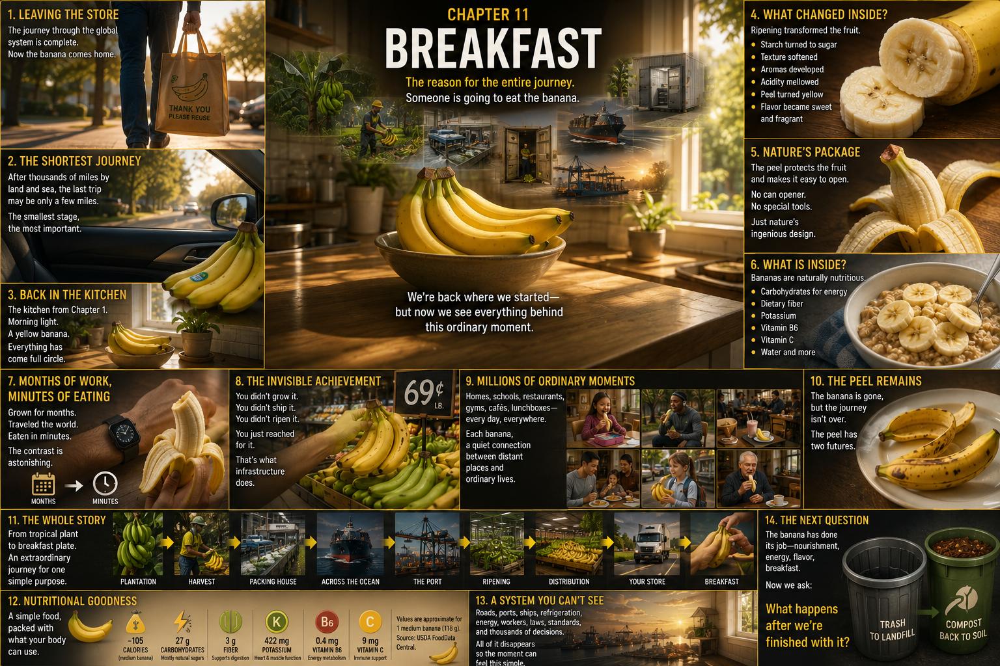

# 11. Breakfast

The banana rests inside a grocery bag.

Above it are a carton of eggs, a loaf of bread, and the papery green tops of
carrots. The bag rises from the cart. Automatic doors slide apart. For a moment,
the bright produce aisle remains behind; ahead, morning sunlight pours across
the pavement.

The shopper carries the bag toward a car. In another version of this ordinary
scene, it hangs from a bicycle basket, rides beside someone on a bus, or swings
gently at the end of a short walk home. The route changes with the person and
the place. What has changed for every banana at this moment is more important:
the commercial supply chain is no longer carrying it.

The banana has been grown, sold, packed, shipped, imported, ripened,
distributed, displayed, and bought. Ownership has passed across a checkout.
Nobody at a port or warehouse will decide its next move.

The final stage belongs to an ordinary person.

## The Shortest Journey

Set the grocery bag on the passenger seat. A yellow curve shows through the
opening as houses pass beyond the window.

This banana may have crossed a plantation on a cableway, traveled regional
roads to an international port, crossed an ocean, entered another port, and
moved through highways and distribution networks. Its route has been measured
in days, borders, and thousands of miles.

Now it travels a few miles—or a few blocks.

This is the smallest transportation stage in the story. There is no container,
manifest, crane, refrigeration unit, or pallet. There is only a bag on a seat
and a hand that keeps it from tipping at a turn. Yet this modest trip accomplishes
what all the larger ones could not.

A ship delivered the banana to a country. A truck delivered it to a store.

**A person delivers it to its purpose.**

## The Counter, Once More

The front door opens. Groceries cross the kitchen. Eggs go into the refrigerator;
bread finds the cupboard. The bananas are lifted into a shallow bowl beside two
apples.

Morning light reaches across the kitchen counter and stops at a banana.

We have seen this room before.

It is the quiet kitchen of Chapter 1: countertop, fruit bowl, yellow peel, a few
brown freckles, perhaps a small blue sticker. Then, the banana seemed ordinary
because almost everything behind it was invisible. Now the same curve holds a
depth that the counter cannot contain.

Behind it, not as a list but as brief afterimages, rain shines on tropical
leaves. A worker lowers a heavy bunch. Green hands turn in packing-house water.
Cold air rises through boxes inside a reefer. A crane stands above a port. A
ship moves beneath stars. In a ripening room, green gives way to yellow. A truck
runs at sunrise. A produce worker rebuilds a grocery display.

Then the images fade.

The refrigerator hums. A spoon touches a bowl. Sunlight moves by an inch.

One banana.

One kitchen.

## Ready to Be Wanted

The fruit that left the farm was hard, green, and starchy. The one on the
counter yields slightly beneath a thumb and smells unmistakably like a banana.
Ripening made the difference.

As the fruit ripened, enzymes broke down much of the stored starch in its pulp
and sugars accumulated. Other changes helped soften the tissue: the structures
that hold plant cells together were altered, making the firm green fruit become
tender. Volatile compounds developed and changed, creating the aromas that
reach the nose before the first bite. In the peel, green chlorophyll diminished
and yellow pigments became visible; later browning and spotting may appear as
the fruit continues to age.

These changes meet in the mouth. Sweetness replaces much of the green fruit's
starchy taste. The texture becomes creamy rather than rigid. Aroma joins taste
to make flavor. People differ about the ideal moment—some choose a clear yellow
peel, others wait for freckles—but the destination was never simply an intact
banana.

The system was trying to deliver a banana someone would want to eat.

## Open Here

A hand reaches into the bowl.

The thumb presses against the stem. The peel splits with a faint sound. One
strip folds down, then a second and a third, exposing the pale fruit inside.
Fibrous strands cling between peel and pulp. The room fills with a little more
aroma.

No can opener was needed. In ordinary circumstances, neither was a knife. No
factory wrapped this individual fruit in plastic. The peel grew along with the
pulp, forming an outer structure that helps protect the softer edible tissue
from drying, dirt, rubbing, and minor impacts—and then provides a remarkably
convenient way to open it.

That does not make the peel invincible. We have seen how easily pressure,
scrapes, poor temperature control, and rough handling can damage a banana.
Commercial fruit still depended on careful hands, cartons, liners or padding
where used, pallets, airflow, refrigeration, and timing. Biology supplied one
layer of packaging. Human systems built many other layers around it.

Here, at the final handoff, those layers fall away. Cardboard stayed at the
store or was unpacked earlier. Pallets and containers have gone elsewhere. The
only package in the hand is the one the plant made.

## Inside the Curve

Break the fruit across its middle. The cross-section is pale cream, moist, and
soft, with tiny dark flecks marking undeveloped ovules rather than the hard,
mature seeds found in wild bananas.

Most of the edible fruit is water and carbohydrate. At eating ripeness, those
carbohydrates include natural sugars as well as some remaining starch. A banana
also provides dietary fiber, potassium, vitamin B6, vitamin C, and smaller
amounts of other nutrients. Exact quantities depend on the size and composition
of the serving, and a person's whole diet matters far more than heroic claims
about any single food.

This is not a miracle medicine. It is food: sweet, soft, portable, and ready to
become part of breakfast.

Slices fall onto oatmeal. Pale circles overlap berries and grains. Elsewhere,
the fruit might disappear into a smoothie, lie across toast, or simply be eaten
from its peel beside a sunny window.

## Months, Then Minutes

Place two timelines beside each other.

The first begins underground, where a shoot rises from a corm. Leaves unfurl.
The plant gathers light and water. A flower moves through the pseudostem, fruit
forms, and a bunch fills over months. Then come harvest, packing, cooling,
regional transport, port, ocean, port again, ripening, distribution, retail,
and the trip home.

The second timeline is almost too short to draw:

**peel → bite → bite → bite → gone**

Eating takes minutes.

There is nothing sad in the difference. It reveals something astonishing about
ordinary convenience. Enormous systems routinely organize land, knowledge,
labor, machines, energy, standards, roads, ports, and time to create a moment so
small that it fits between getting dressed and leaving for school or work.

The months were not diminished by the minutes. The minutes were their point.

## What Did Not Have to Happen

The person at the table did not travel to the tropics.

They did not grow a banana plant, judge a mature bunch, carry its weight, or
operate a packing house. They did not cool green fruit without chilling it,
charter a ship, power a refrigerated container, lift it through a port, navigate
customs, manage a ripening room, operate a warehouse, or drive a delivery route
before dawn.

They reached into a display.

That simple action is not proof that the earlier work was easy. It is evidence
that the work connected. Farms, businesses, workers, machines, public
infrastructure, and rules met across boundaries well enough that the final user
did not need to become an expert in any of them.

> **Functioning infrastructure hides complexity behind ordinary experiences.**

When such a system works, it does not announce every successful handoff. The
light switch does not describe the electrical grid. The faucet does not display
the water network. The banana does not tell the story of the ship.

It simply arrives where it can be useful.

## Breakfast, Breakfast, Breakfast

Pull back from the sunny window.

In another kitchen, a parent cuts banana over cereal. In a school cafeteria,
one rests on a tray. A restaurant cook lays slices across a plate. At a smoothie
shop, peeled fruit drops into a blender. An athlete eats one before a run. A
child opens a lunchbox and finds a yellow curve beside a sandwich.

Pull back farther. Apartment windows and kitchen windows gather into blocks.
Blocks become cities. Other cities appear in other regions, each with its own
stores, streets, eating habits, and ways of moving food the final distance.
There is no need to assign an exact number to the image. The repetition is the
fact that matters: ordinary eating moments, happening again and again.

Not every banana traveled our banana's route. Some were grown close to the
people who ate them. Others crossed different borders, used different ports,
or never entered a refrigerated container. Some were cooked while green rather
than eaten sweet. But each meal joined biology and human organization. Each
piece of fruit had a before.

For one person, it is only breakfast.

Seen together, those breakfasts are the reason fields connect to cities.

## What Remains

Return to the table.

The oatmeal bowl is nearly empty. The spoon rests at its edge. The banana itself
is gone—its carbohydrates, water, fiber, minerals, vitamins, aroma, sweetness,
and texture taken into a human body. The system that began beneath tropical
leaves has achieved its purpose.

**energy + nutrition + flavor + breakfast**

But beside the bowl lies the peel.

For the first time in this journey, part of the fruit has become something its
holder does not want. Everyone before this moment worked to preserve and deliver
the banana. Now its edible portion has been consumed, and the remaining package
must go somewhere.

A hand picks it up.

Nearby are two possibilities. One is a trash bin. From there, depending on the
local waste system, the peel may travel in a garbage truck toward a landfill.
The other is a household compost container or a bin for separately collected
organic material. On that route, decomposers may turn its tissues toward compost
and soil.

Neither destination happens by symbolism. Local collection, facilities,
household practice, and the conditions in which material is managed determine
what comes next. The peel has entered infrastructure again.

> **Eating the banana ends one journey and begins another.**

For ten chapters, the question was:

> **How does the banana reach us?**

Now, in the quiet after breakfast, the question changes:

> **What happens after we're finished with it?**

Next: **Chapter 12 — The Peel Has Two Futures**

## Sources and Further Reading

- [UC Davis Postharvest Research and Extension Center: Banana produce fact
  sheet](https://postharvest.ucdavis.edu/produce-facts-sheets/banana)
- [U.S. Department of Agriculture FoodData Central: Bananas,
  raw](https://fdc.nal.usda.gov/fdc-app.html#/food-details/173944/nutrients)
- [Mohapatra, Mishra, and Sutar, *Journal of Scientific & Industrial Research*:
  Banana and its by-product utilisation—an
  overview](https://nopr.niscpr.res.in/handle/123456789/6253)
- [Food and Agriculture Organization of the United Nations: Fruit and vegetable
  processing—banana products](https://www.fao.org/4/V5030E/V5030E0q.htm)
- [U.S. Environmental Protection Agency: Composting food
  scraps](https://www.epa.gov/sustainable-management-food/composting)
- [U.S. Environmental Protection Agency: Basic information about landfill
  gas](https://www.epa.gov/lmop/basic-information-about-landfill-gas)

---

[← 69¢ a Pound](10-69-cents-a-pound.md) · [Contents](../CONTENTS.md) · [The Peel Has Two Futures →](12-the-peel-has-two-futures.md)
