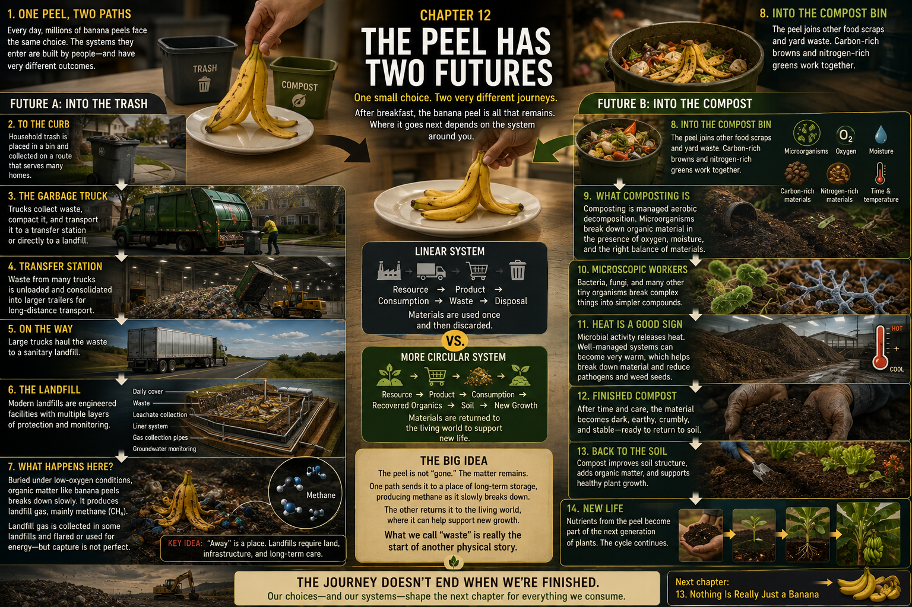

# 12. The Peel Has Two Futures

A banana peel sits on a breakfast plate.

The oatmeal bowl is empty now. Morning light has moved across the table. A hand
picks up the three soft yellow-brown strips that, only minutes ago, wrapped the
fruit through rain, packing, an ocean crossing, ripening, shopping, and
breakfast.

Nearby are two containers.

One says **TRASH**.

The other says **COMPOST** or **ORGANICS**.

Pause the hand between them.

For eleven chapters, the banana followed an increasingly narrow path:

**plantation → packing house → cold chain → ship → port → ripening →
distribution → store → kitchen → breakfast**

Now the page divides. To the left, the light turns gray: plastic cart, steel
truck, concrete transfer floor, compacted landfill cell. To the right, it turns
brown and green: food-scrap pail, leaves, warm vapor, microorganisms, roots.

This is not a portrait of one careless person and one virtuous person. In some
places both containers exist. In others, only the trash does. A choice at the
table matters, but collection services, rules, buildings, facilities, costs,
and public participation have already shaped the choices within reach.

The peel has two possible futures. Follow the dark path first.

## Future A: Into the Trash

The lid closes.

The peel falls among coffee grounds, wrappers, a paper towel, and the other
small remainders of a household day. Later, the bag is tied, carried outdoors,
and lowered into a collection cart. Before sunrise, hydraulic machinery grips
the cart and tips its contents into a truck—or workers lift and empty containers
by hand, depending on the local system.

**kitchen trash → household garbage → collection cart → garbage truck**

The banana has entered logistics again.

The vehicle moves from house to house, or stops beside an apartment building's
shared containers. Brakes sigh. Warning lights flash on wet pavement. A worker
watches the street, the hopper, passing cars, and the machinery. Behind the cab,
a compactor presses loose bags into a denser load so the truck can collect more
before it must unload.

Earlier, a refrigerated truck protected something valuable. This truck carries
things their holders have decided are not. Yet removing them still requires
**people + vehicles + fuel + equipment + land + infrastructure**. Routes must
be planned. Trucks must be maintained. Workers must be trained and protected.
Waste must reach a permitted destination.

The truck does not make the peel disappear. It changes the peel's location.

> **“Away” is a place.**

## A Larger Load

In some communities, the collection truck drives directly to a disposal site.
In others, it enters a transfer station and backs onto a broad tipping floor.
Its compressed load joins many others beneath a high roof. Loaders and
compactors move the mixed waste into larger trailers or other long-haul
vehicles, which carry it farther.

Not every waste system uses a transfer station, and designs vary. But the idea
is familiar from the banana's journey. Small vehicles are useful for repeated
neighborhood stops; larger vehicles can be more efficient for the long distance
between a city and a disposal facility. As Chapter 10 showed, consolidation
changes the economics of movement.

Even garbage travels by scale.

## A Landfill Is an Engineered Place

The trailer passes a gate and a scale. Beyond it, earthmoving machines cross a
working face where the day's waste is placed, spread, and compacted. This is not
simply an open pile in a field. In a modern sanitary landfill, waste is managed
within an engineered site.

In the United States, federal criteria for municipal solid-waste landfills
address features such as composite liners, leachate collection, operating
practices, groundwater monitoring, closure, and post-closure care; state and
local requirements also apply. Systems differ between jurisdictions and sites.
A cutaway of one landfill might show a disposal cell above layers designed to
limit the movement of contaminated liquid. Pipes collect **leachate**—water
that has passed through waste and picked up dissolved or suspended material—so
it can be managed. Separate controls direct stormwater. Monitoring wells help
operators look for changes in groundwater.

At the working face, heavy machines compact the waste. Soil or approved
alternative materials may cover it daily, with intermediate cover on areas
that will wait longer for more waste. Around and beneath the cells are drainage,
roads, scales, pipes, pumps, records, inspections, and environmental controls.
Later, a finished area can receive a final cover designed to reduce water
entering the buried material.

The peel is now one flexible strip inside a compressed, mixed layer.

## Biodegradable Does Not Mean Harmless Soil

It is tempting to imagine that a buried banana peel quickly becomes soil. After
all, it came from a plant. But a landfill is not a compost pile.

As microorganisms consume organic material, the available oxygen in buried
waste can be depleted. Under low-oxygen conditions, **anaerobic** microorganisms
continue decomposition through different processes. Landfill gas forms as a
result. It contains roughly equal shares of methane and carbon dioxide, along
with small amounts of other compounds, although its composition changes with
conditions and time.

Methane is a colorless, flammable gas and a powerful greenhouse gas when it
reaches the atmosphere. A modern landfill may use wells and pipes to collect
some gas. The gas may be flared—converting methane largely to carbon dioxide and
water—or treated and used as an energy source. Collection, however, is not
necessarily complete. Gas can form before, between, or beyond the reach of
collection systems, and performance varies by site and over time.

There is no honest countdown we can print beside our peel. Moisture,
temperature, the surrounding waste, site operation, and many other conditions
affect what happens. What matters is the direction of the process: plant tissue
buried in a low-oxygen disposal system does not behave as it would in a managed,
oxygen-rich compost system.

Hold on the dark cross-section: liner below, cover above, leachate pipes and gas
wells passing through compressed layers. The peel has not gone nowhere. It has
entered a large engineered place intended to contain and manage what a community
discards.

Now run the film backward.

The trailer returns to the transfer station. The collection truck reverses its
route. The cart rolls toward the house. The bag opens. The peel rises out of the
trash and returns to the hand above the breakfast plate.

This time, the hand turns the other way.

## Future B: Into the Compost

The peel drops into a small kitchen container.

The page changes color. Landfill gray gives way to leaf brown, stem green, warm
sunlight, and a faint white curl of steam. But this route is not magic, and
“natural” does not mean unmanaged.

Composting is **managed aerobic biological decomposition**. *Aerobic* means
that oxygen is present. Microorganisms use plant and food material as they live
and reproduce, transforming it into more stable organic matter. Their working
conditions include oxygen, moisture, a useful balance of carbon-rich materials
and nitrogen-rich materials, suitable temperature, and time.

Dry leaves, wood chips, or small twigs can supply structure and carbon. Fresh
food scraps and green garden material tend to provide more nitrogen and
moisture. Too little water slows biological activity; too much can fill air
spaces and restrict oxygen. Turning, mixing, or forced aeration can restore air.
The goal is not one perfect recipe everywhere, but conditions in which aerobic
decomposers can work.

Worms can play the leading role in **vermicomposting**, a particular method.
They are not required for composting in general. Most of the transformation in
an ordinary pile or larger facility is performed by organisms far smaller than
worms.

## Into the Microscopic World

Move close to the peel.

Its smooth yellow surface becomes a ridged landscape. Move closer and plant
fibers cross the frame like fallen beams. Closer still, the scene becomes a
community: bacteria occupy films of moisture; threadlike fungal hyphae extend
through material; other microscopic organisms feed, multiply, and interact.

**banana peel → peel surface → fibers → microscopic community**

Enzymes and biological activity break complex plant material into forms that
organisms can use. Carbon moves into microbial cells, carbon dioxide, and other
products. Water is released and redistributed. Nutrients move through living
organisms and decomposing matter. The cast changes as conditions and available
food change.

Then something surprising becomes visible even without a microscope.

The pile grows warm.

Microbial metabolism releases heat. In a sufficiently large, active, well-run
compost mass, heat can accumulate and temperatures can rise substantially.
Steam may drift from a newly turned windrow in cool morning air. At larger
facilities, operators monitor temperature, moisture, and oxygen and turn or
aerate material. When specified process conditions are actually achieved,
managed heat can help reduce pathogens and weed seeds. Heat alone is not proof
that every part of a pile has been treated adequately; management and process
control matter.

## Two Scales of Compost

On one side of the page is a backyard bin. The peel lies beneath vegetable
scraps and beside dry leaves and garden trimmings. A person adds material,
checks its moisture, and mixes the pile. The route is short: kitchen to yard.

On the other side, a curbside organics cart joins a collection route. A truck
carries many households' material to a processing facility. There, workers
inspect incoming loads and machinery may remove contaminants or prepare the
mixture. Long **windrows** stretch across a paved or prepared surface, or the
material enters an aerated static pile or enclosed system. Machines turn it, or
pipes move air through it. Active composting is followed by curing, when the
material continues stabilizing and maturing before use.

These pictures are possibilities, not universal instructions. Some communities
collect food scraps; some accept only yard material; some have no separate
organics collection. Programs differ over bags, packaging, meat, bones, and
other inputs because their facilities and contamination rules differ. Other
systems may send separated organics to anaerobic digestion, which produces
biogas in oxygen-free conditions, rather than to aerobic composting.

The label on the local bin—not the color green by itself—determines what belongs
inside.

## The Peel Disappears—but Not Really

Days and seasons pass through the picture. The curved strip softens, darkens,
fragments, and becomes impossible to identify.

The **object** disappears.

The **material** continues.

Some of its carbon has been used by organisms or returned to the air, chiefly
as carbon dioxide during aerobic decomposition. Water has moved. Nutrients and
carbon have been incorporated into microbial life and remaining organic matter.
The atoms do not stay together wearing the shape of a peel. They are transformed
and redistributed.

The finished product is not literally soil. Mature compost is a stabilized
organic **soil amendment**. Mixed into garden or agricultural soil, applied in
landscaping, or used in some restoration work, it can add organic matter and
support properties such as soil structure, water holding, and nutrient supply.
The results depend on the compost, the soil, the application, and good
management; compost is useful material, not a cure for every soil problem.

Pour a dark handful across the page:

**compost → soil amendment → roots → plant → food**

Could this peel grow another banana? Not in the neat way an arrow suggests. Its
materials disperse among air, water, organisms, compost, and soil. No one is
likely to track the nutrients from this single peel into one future banana—and
the finished compost may nourish grass, tomatoes, a street tree, or a field far
from any banana plant.

Circularity does not require the same atoms to return to the same fruit. It
means recovering useful organic material so that it can support biological
production again.

## Two Futures, One System Question

Set the paths beside each other.

### Linear

**resource → product → consumption → waste → disposal**

### More Circular

**resource → product → consumption → recovered organic material → soil
amendment → biological production**

The second line bends, but it is not a perfect circle. Collection trucks use
energy. Compost facilities require land, labor, equipment, and management.
Carbon returns to the atmosphere. Water and nutrients disperse. Contamination
can spoil a load. No material can be recovered without limits or impacts.

> **Circular systems attempt to keep useful materials in productive use for
> longer instead of treating every output as an endpoint.**

Whether that path is practical depends on more than the hand at breakfast. An
apartment resident may have no yard. A municipal program may not exist. A
building owner may or may not provide separate collection. Local policy,
available processing facilities, contamination rules, economics, routes, and
public participation all help determine the outcome.

Personal choices matter. Systems determine which choices are available and how
well those choices work.

In either case, the peel enters infrastructure. One system is designed chiefly
to collect, transport, isolate, and control discarded material. The other is
designed to create conditions in which organisms can transform separated
organic material into a useful amendment. Dropping the peel into a bin does not
end its physical story. It selects—or accepts—the next system that will carry
the material.

## Back Into the Living World

End with soil.

Not a truck. Not a ship. Not a warehouse. Not a supermarket.

Dark material rests in someone's palm. The hand tilts, and mature compost falls
into garden soil. Below the surface, pale roots branch between mineral grains,
organic matter, water, air, fungi, and countless microorganisms. Above it, a
green shoot unfolds into sunlight.

The exact atoms from our banana peel cannot be followed neatly into this one
plant. But the larger idea is visible:

**What looked like the end of the banana can become part of another biological
beginning.**

Pull back. The shoot becomes one green point in a garden. Beyond it are homes,
collection routes, facilities, roads, and the other physical systems of a city.
Farther still, across an ocean, rain falls on broad banana leaves.

We have followed one fruit from tropical soil through an enormous human system
and, along one possible path, toward soil again.

Only one chapter remains.

The final question is no longer:

> Where did the banana come from?

It is:

> **What does this ordinary banana teach us about the way the modern world
> works?**

Next: **Chapter 13 — Nothing Is Really Just a Banana**

## Sources and Further Reading

- [U.S. Environmental Protection Agency: Basic information about
  landfills](https://www.epa.gov/landfills/basic-information-about-landfills)
- [U.S. Environmental Protection Agency: Municipal solid waste landfill
  criteria](https://www.epa.gov/landfills/municipal-solid-waste-landfills)
- [U.S. Environmental Protection Agency: Basic information about landfill
  gas](https://www.epa.gov/lmop/basic-information-about-landfill-gas)
- [U.S. Environmental Protection Agency: Landfill gas energy project development
  handbook](https://www.epa.gov/lmop/landfill-gas-energy-project-development-handbook)
- [U.S. Environmental Protection Agency: Composting](https://www.epa.gov/sustainable-management-food/composting)
- [U.S. Environmental Protection Agency: Approaches to composting](https://www.epa.gov/sustainable-management-food/approaches-composting)
- [U.S. Department of Agriculture Natural Resources Conservation Service:
  Compost](https://www.nrcs.usda.gov/sites/default/files/2022-10/Compost.pdf)
- [Cornell Waste Management Institute: The science and engineering of
  composting](https://compost.css.cornell.edu/science.html)
- [Washington State University Extension: Compost fundamentals](https://pubs.extension.wsu.edu/compost-fundamentals)

---

[← Breakfast](11-breakfast.md) · [Contents](../CONTENTS.md) · [Nothing Is Really Just a Banana →](13-nothing-is-really-just-a-banana.md)
